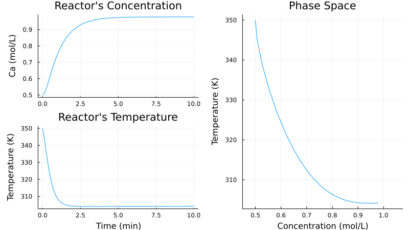
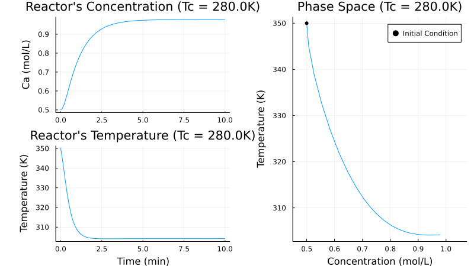

- [1. Introduction](#1-introduction)
- [2. Problem Specifications](#2-problem-specifications)
  - [2.1. Kinetics](#21-kinetics)
  - [2.2. Reactor Model](#22-reactor-model)
  - [2.3. Parameters](#23-parameters)
- [3. Results](#3-results)
  - [3.1. Creating and Simulating CSTR Model](#31-creating-and-simulating-cstr-model)
  - [3.2. Plotting Simulation Results](#32-plotting-simulation-results)
  - [3.3. Coolant's Temperature Effect](#33-coolants-temperature-effect)


# 1. Introduction

This repo aims to start my contact with the Julia Language. The example I've selected to do so is a Continuous Stirred-Tank Reactor (CSTR) where a generic first order exhotermic reaction takes place on a reactor with a cooling medium. This problem was copied from Process Dynamics and Control book from Seborg, Edgar, Mellichamp and Doyle (4ª Edition, page 27 Example 2.5.).

# 2. Problem Specifications

## 2.1. Kinetics

In the reactor we have a generic first order reaction governed by the equation: 

$$A \xrightarrow{kC_a} Products$$ (2.1)

The constant rate $k$ follows Arrhenius' law:

$$k(T) = k_0 .exp\left(\dfrac{-E_a}{RT} \right)$$ (2.2)

## 2.2. Reactor Model

In order to model the reactor, one must do the mass and energy balances. Assuming that the reactor is well-mixed one can come up with the following equations:

$$ \dfrac{dC_a}{dt} = \dfrac{q}{V}(C_{A,Feed}-C_a)-kC_a$$ (2.3)

$$\dfrac{dT}{dt} = \dfrac{q}{V}(T_{Feed} - T) + \dfrac{-\Delta H_r}{\rho C_p} kC_a + \dfrac{UA}{V \rho C_p} (T_c - T) $$ (2.4)

## 2.3. Parameters

|   Parameter   | Description               |       Value        | Unit      |
| :-----------: | :------------------------: | :----------------: | :--------: |
|      $q$      | Flow rate                 |       $100$        | $L/min$   |
| $C_{A,Feed}$  | Feed Concentration        |        $1$         | $mol/L$   |
|  $T_{Feed}$   | Feed Temperature          |       $350$        | $K$       |
|      $V$      | Reactor Volume            |       $100$        | $L$       |
|    $\rho$     | Density                   |       $1000$       | $g/L$    |
|     $C_p$     | Heat Capacity             |      $0.239$       | $J/g/K$  |
| $-\Delta H_r$ | Heat of Reaction          |   $5\times10^4$    | $J/mol$  |
|     $E_a$     | Activation Energy         |      $72750$       | $J/mol$  |
|     $k_0$     | Frequency Factor          | $7.2\times10^{10}$ | $min^{-1}$  |
|     $UA$      | Heat Transfer Coefficient |   $5\times10^4$    | $J/min/K$ |
|     $T_c$     | Coolant Temperature       |       $300$        | $K$      |
|   $C_{A,0}$   | Initial Concentration     |       $0.5$        | $mol/L$   |
|     $T_0$     | Initial Temperature       |       $350$        | $K$       |


# 3. Results

To solve this problem the Julia Packages [DifferentialEquations.jl](https://diffeq.sciml.ai/stable/tutorials/ode_example/) and [Plots.jl](http://docs.juliaplots.org/latest/tutorial/#tutorial) were used. The code can be found in the [src/cstr.jl](src/cstr.jl) in this repo.

## 3.1. Creating and Simulating CSTR Model

<<<<<<< HEAD
=======

>>>>>>> main

Since our CSTR model comprises a system of ordinary differential equations (ODEs) we need to create a function that will return the derivatives for each variable (i.e. concentration and temperature) to use it in a numerical solver. To solve a system of ODEs using [DifferentialEquations.jl](https://diffeq.sciml.ai/stable/tutorials/ode_example/) our function must have as arguments du,u,p and t, where:

<<<<<<< HEAD
- du: Derivatives array
- u: States array
- p: Parameters that the system of ODEs might relay on
- t: Time  
=======

>>>>>>> main

Thus, our CSTR model can be written as:

```julia
function cstr(du,u,p,t)
    Ca,T = u # States
    Ea,k₀,V,ρ,Cₚ,ΔH,UA,q,Caf,Tf,Tc = p # Parameters
    k(x) = k₀*exp(-Ea/8.314/x) # kinetic constant

    du[1] = dCa = (q/V)*(Caf-Ca) - k(T)*Ca # derivatie of Ca
    du[2]  = dT = (q/V)*(Tf-T) + (-ΔH/ρ/Cₚ)*k(T)*Ca + (UA/V/ρ/Cₚ)*(Tc-T) # Derivative of T

end
```
Now the CSTR can be simulated as:

```julia
u0 = [Ca0 , T0] # Initial Condition Array
p = [Ea,k₀,V,ρ,Cₚ,ΔH,UA,q,Caf,Tf,Tc] # Parameters Array
tspan = (0.0 , 10.0) # Creating time span to solve the ODE from 0 to 10 min
prob = ODEProblem(cstr,u0,tspan,p) # Proper way to create the problem: ODEProblem(model,u0,tspan,p)
sol = solve(prob,Tsit5(),saveat=0.1) # Solving the problem and saving the results at each 0.1 min
```

The first three lines are needed to specify our problem where we create an initial condition array, a parameters array and a time span array that will be used in the ODE solution. In the fourth line we create the problem to be solved using the ODEProblem function and passing its arguments. Finally, we solve using the solve function and passing our ODEProblem, the solver we want to use (Tsit5() is a solver for non-stiff ODEs, good first choice) and saving the results with a 0.1 time-step.

## 3.2. Plotting Simulation Results

I'll write something later.



## 3.3. Coolant's Temperature Effect

I'll write something later.

